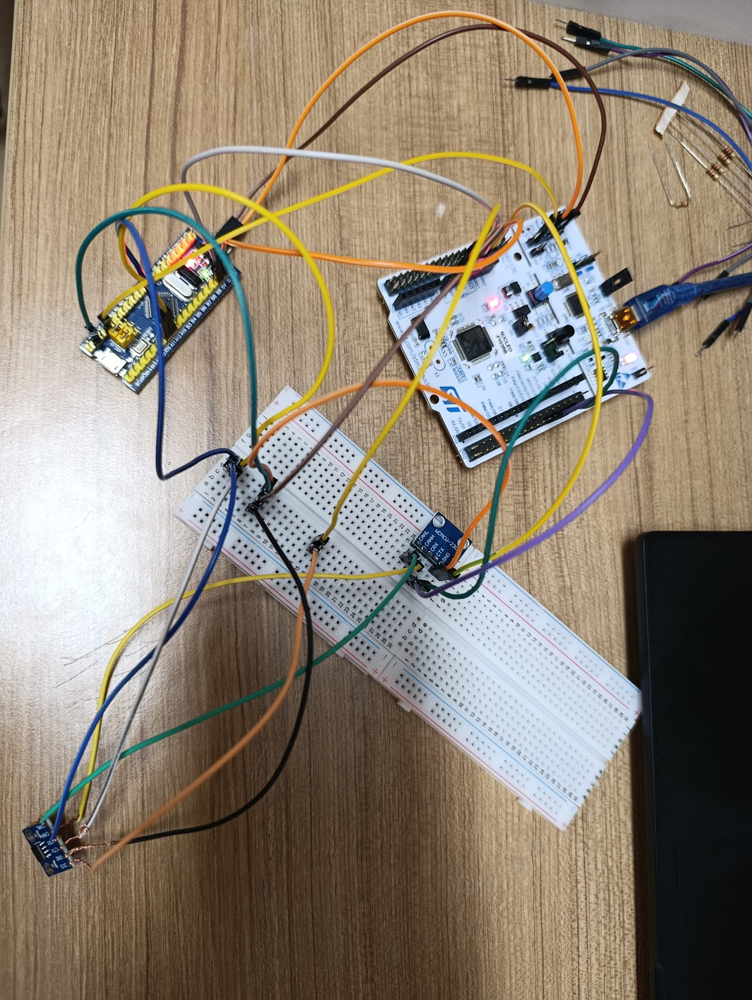

# Automotive CAN-Bus Communication: Distributed STM32 Node Architecture

This project implements a robust **CAN-Bus 2.0B** communication network between two different STM32 families (**F103RBT6 Nucleo** as Master and **F103C8T6 BluePill** as Diagnostic Node). The system utilizes an interrupt-driven architecture to simulate real-time automotive data transmission, such as engine RPM and temperature.

## 🛠️ Hardware Components
* **Master Node:** STM32F103RBT6 Nucleo-64.
* **Diagnostic Node:** STM32F103C8T6 BluePill.
* **Transceivers:** 2x SN65HVD230 CAN Transceivers.
* **Programmer:** On-board ST-LINK v2.1 (from Nucleo).

---

## 🔌 Hardware Configuration & Programming

One of the unique aspects of this project is using a single Nucleo board to program both itself and the BluePill node by utilizing the ST-LINK bridge.

### 🔵 Programming the BluePill (The "Bridge" Method)
1. **Jumper Configuration:** Remove the two **CN2** jumpers on the Nucleo to isolate the ST-LINK. Ensure a jumper is placed on **JP1** for stable power delivery.
2. **Wiring (CN4 Header):** Connect the BluePill to the Nucleo's CN4 header using the following pinout (Top-down, USB port at the top):
   * **Pin 2:** SWCLK
   * **Pin 4:** SWDIO (SWO)
   * **Pin 5:** Reset (Connect to BluePill's NRST)
3. **Software Setup:** * Generate the `.hex` file in **STM32CubeIDE** after a successful build.
   * Open **STM32CubeProgrammer**, go to the "Erase & Programming" tab, and select your hex file.
   * Click **Start Programming** (Ensure "Verify programming" and "Run after programming" are checked for stability).

### ⚪ Programming the Nucleo
1. Disconnect the header wires from the BluePill.
2. **Replace the two CN2 mini-jumpers** to reconnect the ST-LINK to the Nucleo's main MCU.
3. Flash the Master code directly via STM32CubeIDE.

---

## ⚡ Technical Challenges & Solutions (The "Engineering" Lessons)

During the initial stages, the system failed to communicate. The following hardware-level optimizations were implemented to achieve 100% stability:

### 1. The Power Bottleneck (Critical)
* **Problem:** Attempting to power the SN65HVD230 transceivers from the BluePill's 3.3V pin caused communication failure. The BluePill's on-board LDO was insufficient for the transceiver's current spikes.
* **Solution:** Both CAN transceivers must be powered directly from the **Nucleo’s power rails**. Additionally, powering the BluePill with **5V** from the Nucleo (instead of 3.3V) provided better stability for its internal regulators.

### 2. Common Ground (GND) Continuity
* **Problem:** Floating signals caused "No-ACK" errors.
* **Solution:** Established a strict **Common Ground** between the Nucleo, BluePill, and both CAN modules. Even if multiple GND connections seem redundant, they are essential for automotive signal integrity.

### 3. Software Architecture: Polling vs. Interrupt
* **Problem:** High CPU overhead during continuous data polling.
* **Solution:** Implemented **CAN RX Interrupts**. The BluePill now stays in a low-load state and only processes data when a specific Message ID (0x123) is detected, mimicking a real ECU's behavior.

---

---

## 📊 Features
* **Baud Rate:** 125 kbps with optimized Sampling Point (%88).
* **Event-Driven:** LED toggling based on successful CAN frame reception.
* **Data Structuring:** Simulated RPM (16-bit) and Temperature (8-bit) data packets.

---

**Author:** [Yunus Kunduz]
*Electrical and Electronics Engineering Student | Embedded Systems Enthusiast*
